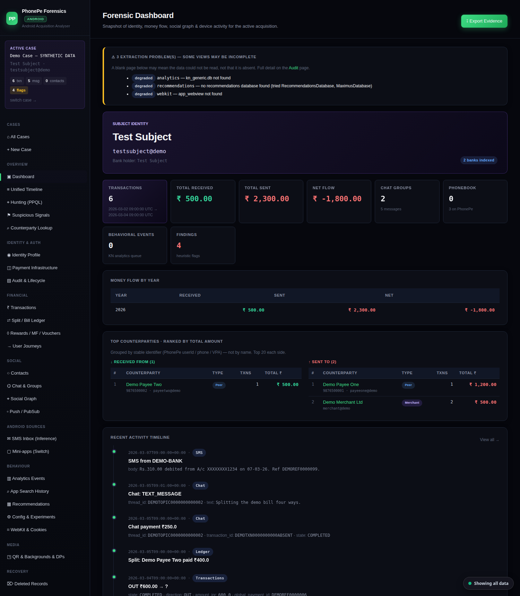
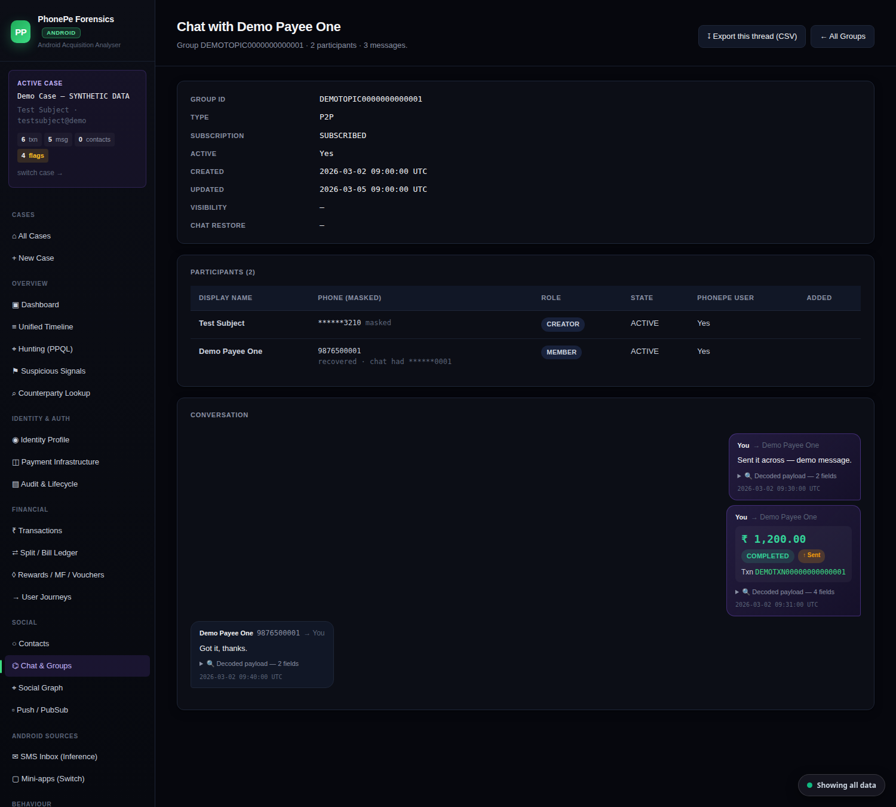
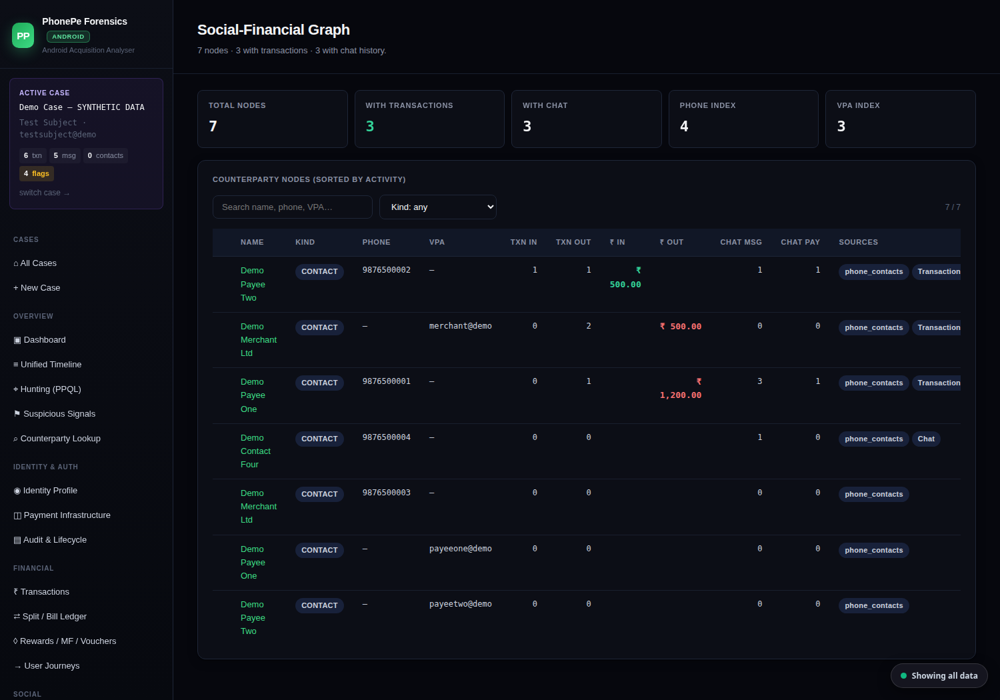
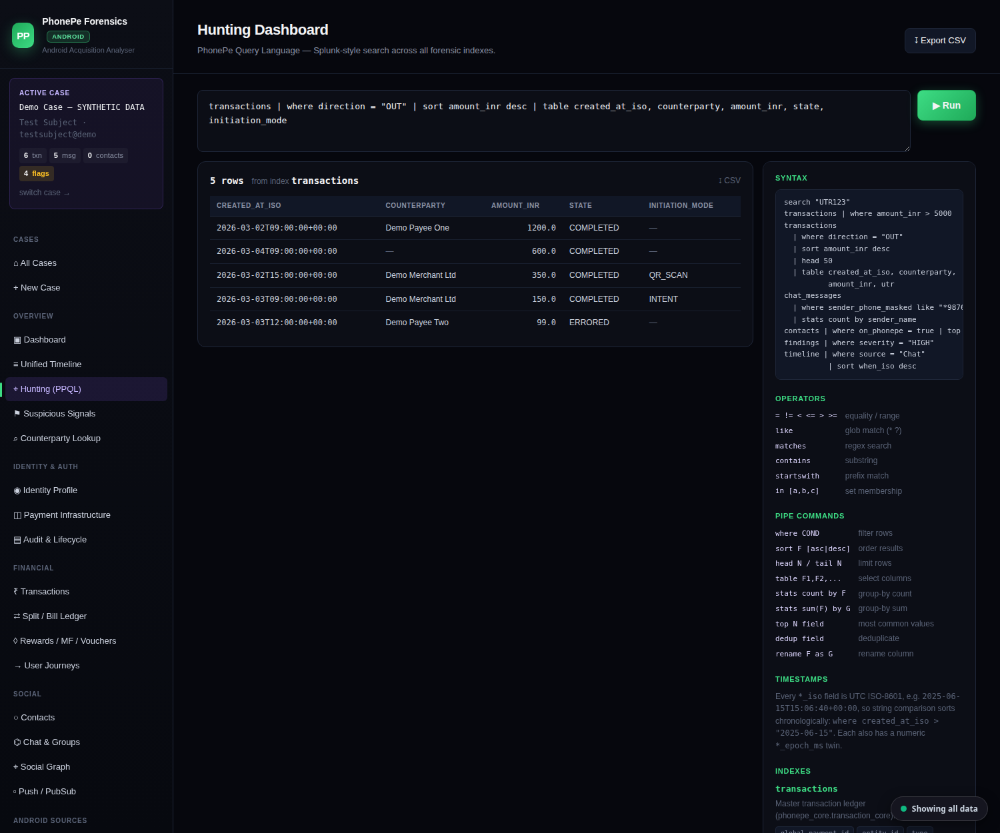

# PhonePe Android Forensics

## Credits & Acknowledgements

This tool was **inspired by, [Sujay Adkesar](https://github.com/sujayadkesar)'s
[PhonePe-Forensics](https://github.com/sujayadkesar/PhonePe-Forensics)** project. Sujay's repository was
used as the **reference** to code this Android tool and to **understand the PhonePe forensic architecture**

> 🔜 **Coming soon:** this Android tool will be **merged back into Sujay's repo** so there is a **single
> tool that handles both iOS and Android** — instead of two separate tools. You'll pick the platform on
> launch and the analyser loads the matching parser and layout.

---

A local, **read-only** DFIR web tool that parses a PhonePe **Android** acquisition
(`com.phonepe.app`) and presents transactions, chat, contacts, the split/bill ledger,
identity & device fingerprint, a unified timeline, social graph and suspicious-signal
findings — all in a browser, with full source provenance for every field.

This is the **standalone, fully-Android** build: it boots straight into the Android
workspace (no operating-system picker) and parses every case as an Android acquisition.

> ⚠️ **Handles real personal data.** A PhonePe acquisition contains a person's complete
> financial, social and identity history. Use only on evidence you are authorised to
> examine. The tool is strictly read-only, but **never commit acquisitions, generated
> output, or the case registry** — they are excluded by `.gitignore` for this reason.

### How "read-only" is enforced

The evidence directory is never written to, so it works on a read-only mount and stays
byte-identical to the manifest taken at seizure:

- Every database and its `-wal` / `-shm` / `-journal` sidecars are **SHA-256 hashed before
  parsing**. The manifest appears on the Audit page and in `chain_of_custody.json`.
- A database with **no WAL** is opened in place with `immutable=1`, which cannot create or
  modify a file. (SQLite's ordinary `mode=ro` cannot do this: it still needs to create a
  `-shm` next to the database, which fails on read-only media and mutates the folder when
  it succeeds.)
- A database **carrying a WAL** is copied with its sidecars to a scratch directory and
  recovered there, so WAL-resident records are included without touching the original. The
  connection is switched to `query_only` once the schema is read.
- If a scratch copy cannot be staged, the database is opened `immutable` in place and a
  warning is raised on the dashboard, the Audit page and the exported report saying that
  `-wal` content is **not** included.

**All timestamps are UTC**, stated explicitly: `iso` is ISO-8601 with a `+00:00` offset and
`display` is suffixed `UTC`. The timestamp embedded in a PhonePe transaction ID is reported
as raw wall-clock digits and labelled *unvalidated* — the issuing server's timezone is
undocumented, so it is not treated as independent corroboration.

---

## Screenshots

> **Every screenshot below is a fabricated demo case, not evidence.** The subject is
> `Test Subject`, the counterparties are `Demo Payee One`/`Demo Merchant Ltd`, and every
> number is in the `9876500000` documentation range. No real acquisition was used to produce
> any image here — the fixture is built from nothing by
> [`notes/make_demo_acquisition.py`](notes/make_demo_acquisition.py), which fills PhonePe's
> real table shapes with invented rows. Note the sidebar in each shot: the case is literally
> named *SYNTHETIC DATA*.
>
> The fixture uses the **real schema on purpose**, so these pages are produced by the same
> extractors, correlator and templates that parse evidence — a mock would show a screenshot
> that proves nothing. Panels that are empty are empty because the fabricated case genuinely
> has no such data.

**Dashboard** — identity, money flow, top counterparties ranked by stable identifier (not by
name), recent activity, and an honest banner naming every source that could not be read.



**Transaction ledger** — direction, counterparty, state and instrument per row, with
`MERCHANT` / `PEER_TO_PEER` classification and `QR`/`INTENT` initiation tags read from the
payload rather than inferred.


**Unified timeline** — every evidence database merged into one chronology: transactions, chat,
ledger splits, SMS, push notifications and device-sync events, each labelled with its source.


**Chat thread** — reconstructed conversation with payment cards inline. The participants table
shows masked→real recovery working: `9876500001` recovered where the chat itself stored only
`******0001`, with the recovery labelled as such rather than presented as if it were stored.



**Split / bill ledger** — who paid, who owes, and the settlement→transaction link. The
subject's net position spells the direction out in words instead of leaving it to the sign.


**Social-financial graph** — one node per identifier, with transaction and chat activity joined
onto it and each node's evidence sources listed.



**PPQL hunting** — an SPL-style query language over every index, with CSV export.



**Suspicious signals** — heuristic findings, each carrying its own supporting data. Note the
two honest ones: a "no deleted records recovered" finding that states outright it is *not*
evidence nothing was deleted, and an uncorroborated-payments finding that reports the ledger's
retained date range so absence-by-retention is not mistaken for deletion.


**Audit & lifecycle** — the SHA-256 manifest taken *before* parsing, how each database was
opened (`immutable` in place vs recovered against a scratch copy), and every extraction
degradation. The evidence path shown is the throwaway temp directory the fixture was built in.


**Provenance** — the source database, table and column, or the JSON path inside a payload,
behind every field the tool displays. This page contains no case data at all: it is the
tool's own account of how it reads evidence.


### Regenerating the screenshots

```bash
python notes/make_demo_acquisition.py /tmp/demo-case      # build the synthetic fixture
cd /tmp/demo-case && python /path/to/run.py 127.0.0.1:8791  # serve from a scratch cwd,
                                                            # so the case registry cannot
                                                            # contain a real acquisition
```

Then capture the pages. Two rules, because a screenshot is published data: serve the demo from
a directory that has never held a real case — the sidebar and page context inject the *active*
case's name, subject and root into **every** page, so one stale active case leaks into shots
that have nothing to do with it — and open each finished PNG and look at it, since an image
cannot be grepped.

## Quick start

```bash
pip install -r requirements.txt
python run.py 127.0.0.1:8754
```

Then open the printed URL, click **+ New Case**, point it at the extracted
`com.phonepe.app` folder, and **Process**.

## What you feed it

Point a case at the PhonePe package data directory from a full-filesystem / rooted
Android extraction (Cellebrite, MSAB XRY, ADB backup of a rooted device):

```
.../data/data/com.phonepe.app/          ← select THIS folder
├── databases/                          Room SQLite — phonepe_core holds transactions,
│                                        chat, contacts, ledger (~160 tables)
├── shared_prefs/                       XML key/value (tokens, device IDs, flags)
├── files/                              DataStore, crashlytics, cached blobs
└── app_webview/                        Chromium cookies / local storage
```

## What it surfaces

- **Transactions** — amount, direction, counterparty, instrument, UTR, merchant, search tokens.
- **Chat & groups (Burble)**, **Contacts (Sampark)** — names deep-link to the person's chat thread.
- **Split / Bill ledger** — shared expenses, per-member shares, net balances, settlement→txn links.
- **Identity** — registered name/VPAs, device fingerprint, persistent IDs, sessions, location hints.
- **SMS inference**, **mini-apps (Switch)**, **payment infrastructure**, notifications, analytics.
- **Unified timeline**, **social graph**, **suspicious-signal findings**, **PPQL hunting**.
- **Raw layer** — every table (browsable + CSV), all shared_prefs, files & DataStore, a SQL console.
- **Provenance page** — the source DB/table/column or JSON path behind every surfaced field.

### Masked → real recovery

Where PhonePe source-masks a counterparty (`******1478`), the tool recovers the real
identity by **exact** cross-table lookup (connection_id / member_id / last-10 phone / VPA)
against the user's own contacts, and labels **each** recovered name by origin —
*saved in PhonePe* vs *phonebook* — so you can see both. Matches are exact only and
ambiguous phones (mapping to more than one person) are left unresolved, never guessed.

The same rule governs the social graph: chat activity is attributed by **connection id**,
never by display name, so two different contacts who share a name keep their own threads and
their own message counts. A thread whose counterparty cannot be resolved to a connection is
counted against the thread and marked as such, rather than being attached to a guessed name.

Bank-SMS corroboration matches **exact paise**, within ±30 minutes, one-to-one, nearest in
time first — so a transaction cannot be credited to an SMS belonging to a different payment
of a similar amount, and the confirmed/uncorroborated counts do not depend on row order.

## Deleted-record recovery

Deleting a row does not erase it. SQLite unlinks the cell and returns its bytes to one of
four pools, all of which usually still hold the original payload. The **Deleted Records**
page walks all four and reconstructs what it finds:

| Pool | What it is |
|---|---|
| `freelist` | whole pages released back to the database |
| `freeblock` | a released cell inside a live page |
| `page-slack` | a page's unallocated middle |
| `pre-wal-image` / `wal-superseded` | a page version the WAL replaced — where a WAL-recorded deletion leaves the original row intact |
| `journal` | a rollback journal pre-image |

Recovered rows are matched against the real table schemas by column count and affinity,
then **excluded if they are still present in the live table**, so only genuine deletions are
reported. Each carries its pool, page, byte offset and source file.

Two honesty constraints are built in. A record that fits more than one table is reported
against **all** of them and flagged ambiguous rather than assigned to one. And because
freeing a cell overwrites the record's first serial type, some rows are recovered with their
leading field's boundary *inferred* — those are marked `partial`, and confidence is only
`high` where the record's extent was confirmed structurally.

An empty result is never presented as proof that nothing was deleted: freed space is reused
over time, and a device with `secure_delete` on zeroes it immediately. Whether freed content
survived is reported from what was actually recovered, not from `PRAGMA secure_delete` —
that pragma is per-connection and would describe the examining machine, not the phone.

## Layout

```
phonepe_forensics/
  core/common.py    SQLiteReader, evidence snapshots, timestamps, hashing
  core/ios.py       plist, binarycookies, NSKeyedArchiver, iOS containers
  core/android.py   com.phonepe.app layout, JSON payloads, shared_prefs
  carver.py         deleted-record recovery
  correlator.py     timeline, social graph, corroboration, findings
  hunt.py           PPQL
phonepe_android/    Android extractors + case orchestration
notes/
  smoke_test.py            headless end-to-end run of one acquisition
  make_demo_acquisition.py builds the synthetic case behind the screenshots
  demo_schema.sql          table shapes for that fixture (CREATE statements only)
docs/screenshots/          README images — synthetic data only
```

`core` is split by platform so the shared engine stays maintainable in one place and this
build can take upstream fixes without vendoring a private copy. `phonepe_forensics.core`
re-exports everything, so `from phonepe_forensics.core import X` works regardless of which
module `X` lives in.

## Limitations

- Three databases are **SQLiteCrypt-encrypted** (`AccountAggregatorDatabase`, `mdb`, and a
  UUID-named DB — each carries a `SQLitecrypt.com` header) and are recorded as
  present-but-not-decryptable. The whole-DB AES key is not on disk: the encrypted passphrase
  lives in `shared_prefs/common-encrypted-shared-pref.xml` (AndroidX `EncryptedSharedPreferences`),
  which is wrapped by a Tink keyset, which is wrapped by an **Android Keystore** master key whose
  bytes live in the device **TEE/StrongBox** and never touch the file system. A static image
  therefore cannot decrypt them — that needs the device's secure hardware (e.g. a rooted live
  device or runtime key extraction).

## Architecture

- `phonepe_android/` — the Android parser: `core_android`, `extractors_android` (20+ modules),
  `case_android` (`AndroidCase`), `provenance_android`.
- `phonepe_forensics/` — the **platform-agnostic** engine the Android layer reuses:
  `case` (base), `core` helpers, `correlator` (timeline / social graph / signals), `reports`,
  the Flask `webapp`, templates and static assets.

## Provenance

Vendored from the upstream PhonePe Forensics tool
(`github.com/sujayadkesar/PhonePe-Forensics`) at commit `007473a`, then reduced to an
Android-only distribution. The Android parser and the shared engine were copied (not submoduled),
so fixes made upstream after that point must be re-applied here.

## License

See `LICENSE`.
